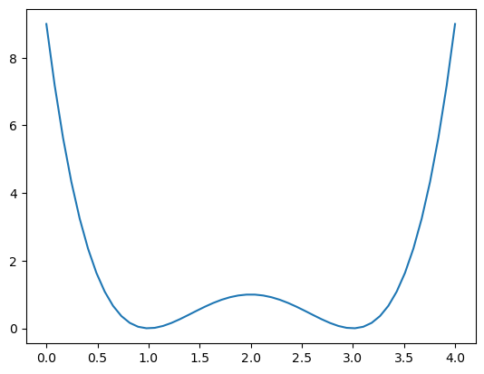

Zadanie 1. Wykonac wykres funkcji z wyktadu g(x) = (x^2 - 4x + 3)^2
na przedziale [0,4]
korzystajac z matplotlib w notatniku Jupyter.


```python
import matplotlib.pyplot as plt
import numpy as np

x = np.linspace(0,4)

y = ((x**2) - (4*x) + 3)**2

plt.plot(x,y)
```


    [<matplotlib.lines.Line2D at 0x11605c920>]


    

    


Zadanie 2. Napisac funkcje dekodujaca ciag wartosci binarnych (podawanych w tablicy Numpy)
na wartosc dziesietna w taki sposób, ze:
• pierwsza wartosc binarna koduje znak (1 oznacza „-", 0 oznacza „+"),
• kolejne wartosci binarne opisuja modut liczby w naturalnym kodzie binarnym.

Przyklad: ciag wartosci binarnych o dlugosci 6: 101011. Pierwsza wartos „1" oznacza znak „-" natomiast kolejne wartosci:
01011 (binarnie) = (0 * 2^4 + 1 + 0 * 2^2 + 1 * 2^1 + 1 - * 2^0) (dziesietnie) = 11 (dzisietnie).
Zatem ciag bitów 101011 koduje liczbe -11 (w zapisie dziesietnym).


```python
bin_num = ["1","1","1","1"] # -7

def bin_to_dec(arr)->int:
    total = 0
    power = 0    
    for i in range(len(arr)-1,0,-1):
        if arr[i] == "1":
            total+=2**power
        power+=1
    if arr[0]=="1":
        total = -total
    return total

print(bin_to_dec(bin_num))
```

    -7


Zadanie 3. Na podstawie powyzszej funkcji utwórz zmodyfikowana funkcje, w której:
• w podawanej tablicy Numpy nie ma kodowanego znaku - caty ciag binarny opisuje wartosc
(nieujemna) w kodzie binarnym,
• funkcja ma dwa dodatkowe parametry: a i b.
Liczba x zwracana prez funkcje ma byé liczba z predzialu ciaglego [a, b], proporcionalna do
wartosci c reprezentowanej przez ciag bitów, tj.:

x = a + (c/(2^k - 1))(b-a)


```python
bin_num = [1,0,0,0, 0, 0] # 32
a1 = 0
b1 = 4
def bin_to_dec(arr, a , b)->int:
    c = 0
    power = 0    
    for i in range(len(arr)-1,-1,-1):
        if arr[i] == 1:
            c+=2**power
        power+=1
        
    x = a + c/((((2**len(arr))-1)))*(b-a)
    return x
print(bin_to_dec(bin_num,a1,b1))
```

    2.0317460317460316

